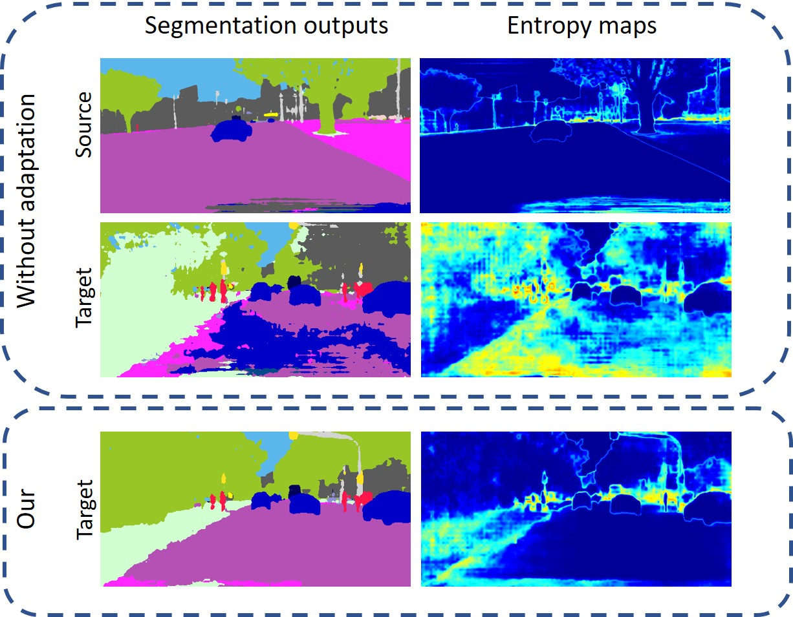

# ADVENT: Adversarial Entropy Minimization for Domain Adaptation in Semantic Segmentation
Code will be available soon.

## Paper


[ADVENT: Adversarial Entropy Minimization for Domain Adaptation in Semantic Segmentation](https://arxiv.org/abs/1811.12833)  
 [Tuan-Hung Vu](https://tuanhungvu.github.io/),  [Himalaya Jain](), [Maxime Bucher](https://maximebucher.github.io/), [Matthieu Cord](http://webia.lip6.fr/~cord/), [Patrick Pérez](https://ptrckprz.github.io/)  
 valeo.ai, France  
 IEEE Conference on Computer Vision and Pattern Recognition (CVPR), 2019 (**Oral**)

If you find this code useful for your research, please cite our [paper](https://arxiv.org/abs/1811.12833):

```
@inproceedings{vu2018advent,
  title={ADVENT: Adversarial Entropy Minimization for Domain Adaptation in Semantic Segmentation},
  author={Vu, Tuan-Hung and Jain, Himalaya and Bucher, Maxime and Cord, Mathieu and P{\'e}rez, Patrick},
  booktitle={CVPR},
  year={2019}
}
```

## Demo
[](http://www.youtube.com/watch?v=Ihmz0yEqrq0 "")